
<a href="">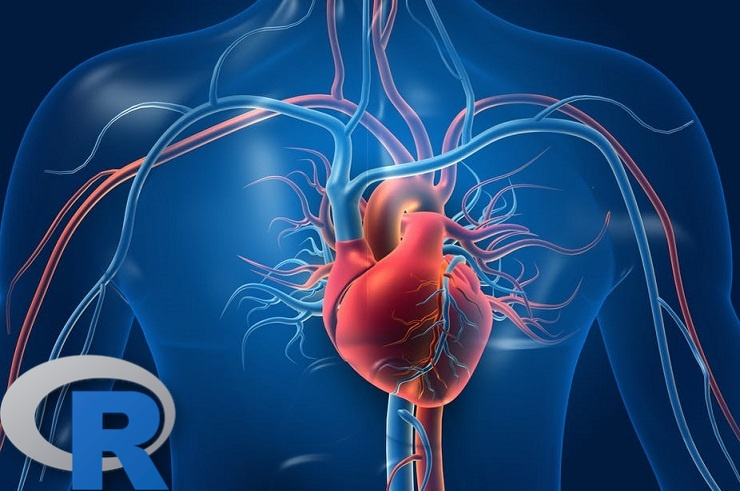</a>

<h1 align="center">Heart Disease Data Analytics Project</h1>

 

## 💬 Project Information:

 

 <h3>

  This is a Data Analytics project based on [Kaggle's Public Heart Disease Dataset](https://www.kaggle.com/johnsmith88/heart-disease-dataset). The dataset was already clean and organized, so no additional cleaning was required. Join us as we import the CSV Dataset into RStudio (R Programming Language) For exploration & visualization.

</h3>

 

## 🌀 [Review Full Code Here ⬅️]()

 
 

## 📊 Quick Look:

 
 

<a href="">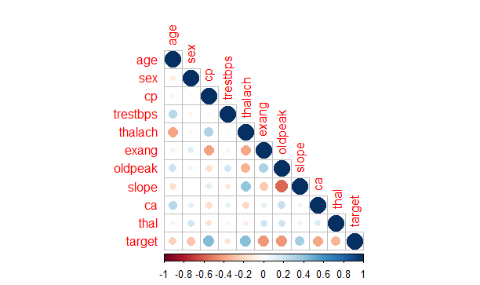</a>

<a href="">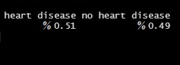</a>

<a href="">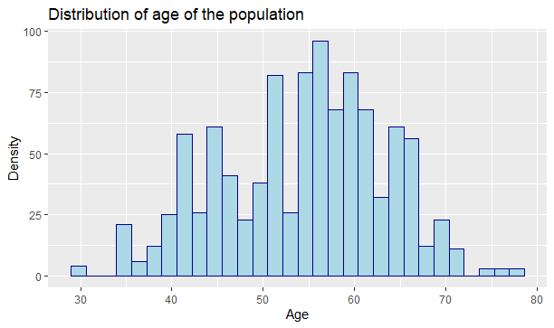</a>

<a href="">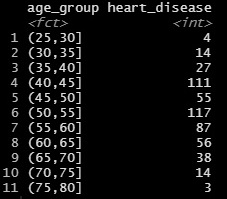</a>

<a href="">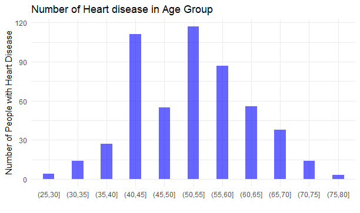</a>

<a href="">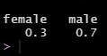</a>

<a href="">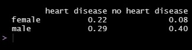</a>

<a href="">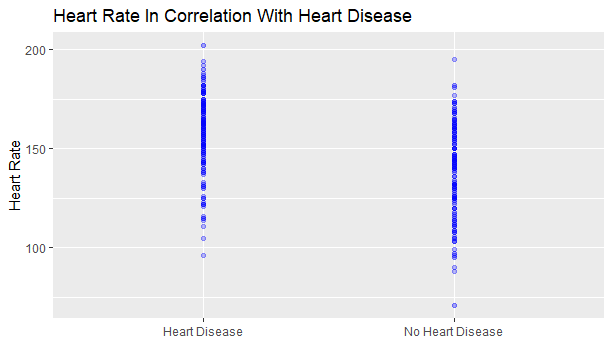</a>

<a href="">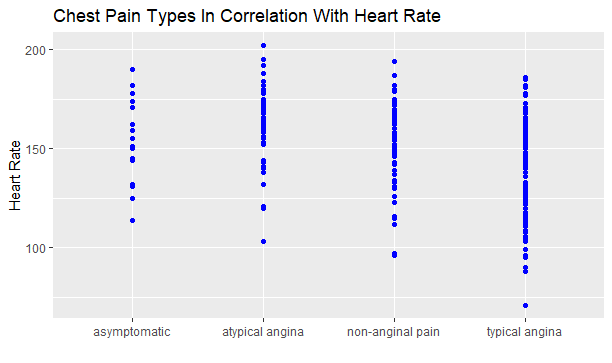</a>

<a href="">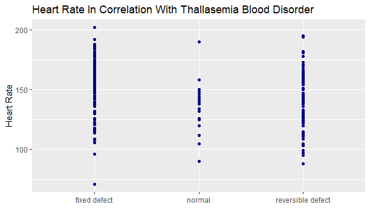</a>

<a href="">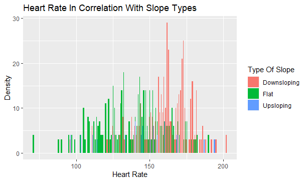</a>

<a href="">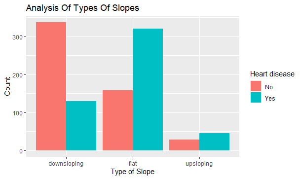</a>

<a href="">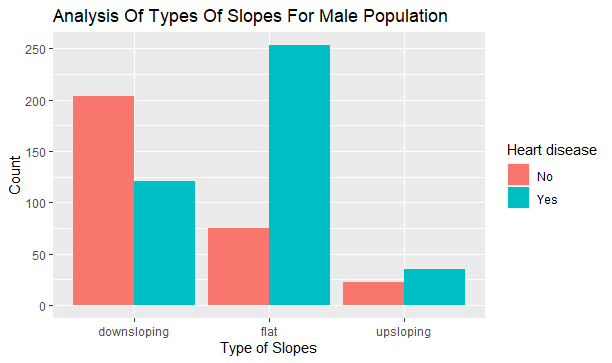</a>

<a href="">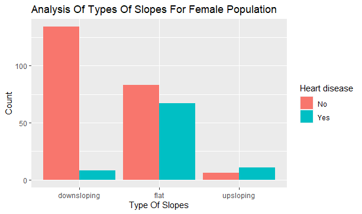</a>

 
 

## 🚀 Languages & Tools Used In This Project:

 

    
    

