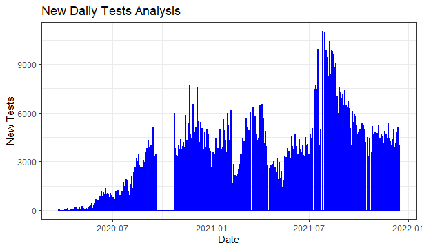
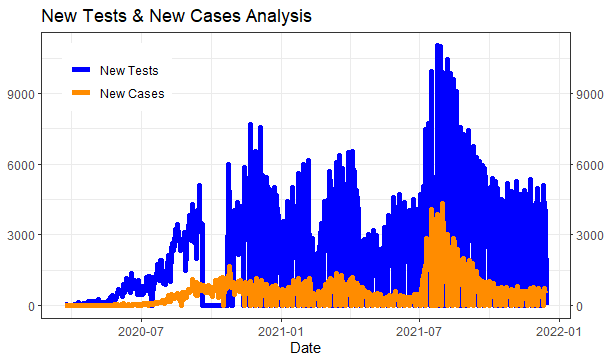

<h1 align="center">Libya Covid-19 Data Analytics Project</h1>

 

## 💬 Project Information:

 

 <h3>

  This is a data analytics project based on Covid-19 data from Libya during the last 16 months.    [Our World Into Data's](https://ourworldindata.org/coronavirus) Official Worldwide Covid-19 dataset was utilized in this project, and we extracted all of the data regarding Libya to generate a new separate CSV dataset, which we then imported into RStudio (R Programming Language) where we cleaned, analyzed and visualized the data.

</h3>

 

## 🌀 [Review Full Code Here ⬅️](https://github.com/Rafik-Alarousi/ProjectPortfolio/blob/main/Libya_Covid_Project/libya_covid_R/libya_covid.R)

 
 

## 📊 Quick Look:

 
 

 
 

## 🚀 Languages & Tools Used In This Project:

 

    
    

